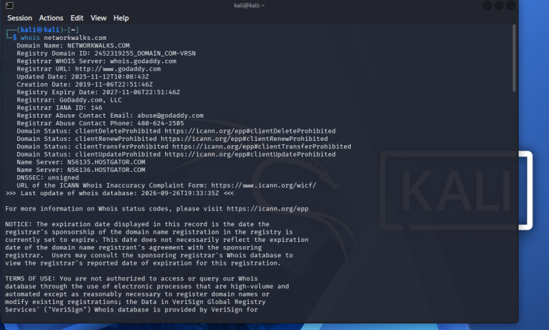
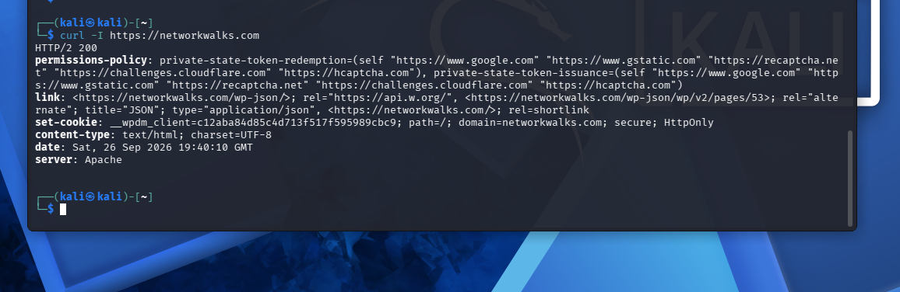

# networkwalks-B083C-week2-Reconnaissance-FootPrinting-
Reconnaissance (FootPrinting)

##  PROJECT OVERVIEW

For Week 2 of the Cyber Security Internship held by network walks I explored Reconnaissance also known as Foot printing. It is the first step into ethical hacking and the aim is to find and gather all accessible information on the target. I tried out multiple tools, being: multi-tool  foot printing on Kali Linux, Google Hacking Database(GHDB), Maltego, Harvester and Nmap.

---

## DISCLAIMER
⚠️ **Important:** This laboratory must only be used for systems that you own or have explicit permission to test. Do not use the lab or its tools to attack unauthorized systems.

---

##  OBJECTIVES
- Run whois, whatweb, nslookup, curl, wafw00f, dnsrecon on Kali Linux against networkwalks.com
- Run Harvester; a pre-installed Kali Linux
- Use Google Hacking Database to find unprotected vulnerabilities
- Install Maltego and find email addresses relevant to networkwalks.com
- Install Nmap and use the Quick scan feature

### 1. Multi-Tool Foot Printing on Kali Linux

I performed reconnaissance against the `networkwalks.com` domain using six Kali Linux tools: **WHOIS, WhatWeb, Nslookup, Curl, Wafw00f and DNSRecon**. Each tool was used to collect a different type of information about the target.

### whois
```bash
whois networkwalks.com
```


First, I used **WHOIS** to obtain publicly available domain registration information and identify the domain’s name servers. The results provided information about the domain registration and hosting infrastructure.



### whatweb
```bash
whatweb networkwalks.com
```
I then used **WhatWeb** to identify technologies used by the website. The results identified WordPress 7.1.2 and WordPress Download Manager 3.3.58, along with other information exposed by the website.


### nslookup

```bash
nslookup networkwalks.com
```
Using **Nslookup**, I resolved the domain name to its IP address. The provided result identified 192.232.216.135.


### curl -I

```bash
curl -I https://networkwalks.com
```
I used **Curl** with the `-I` option to inspect the HTTP response headers. This provided additional information about the web application and exposed the WordPress REST API endpoint wp-json.



### wafw00f

```bash
wafw00f networkwalks.com
```

Next, I used **Wafw00f** to determine whether a Web Application Firewall was protecting the website. The result identified ModSecurity (SpiderLabs).


### DNSRecon

```bash
wafw00f networkwalks.com
```
Finally, I used **DNSRecon** to enumerate DNS records. The results provided information relating to name servers, mail servers, SPF/TXT records, service records and DNS software information.

## 4.2 Network Scanning with Zenmap

For the second activity, I used **Zenmap** to perform network discovery on my local network. The practical required me to identify my local IP address and subnet, discover live hosts, identify their IP and MAC addresses, and generate a network topology.

I first used the Windows `ipconfig` command to identify my local IP address and LAN subnet. I then entered the subnet into Zenmap and selected **Ping Scan** to identify active hosts.

The example results provided in the practical identified four live hosts:

- `10.0.0.1`
- `10.0.0.4`
- `10.0.0.19`
- `10.0.0.5`

The example results also included four MAC addresses.

After completing the scan, I opened the **Topology** section in Zenmap, enabled the legend and saved the network topology in PDF format as required by the practical task.

**Note:** The actual subnet, number of hosts and addresses should be replaced with the results from my own network when submitting the report.

# 5. Risk Analysis / Impact

Based on the information collected during the footprinting and network scanning activities, I identified the following potential risks.

| **\#** | **Risk / Finding**                           | **Evidence / Observation**                                  | **Potential Impact**                                                                                            | **Risk Level** |
|--------|----------------------------------------------|-------------------------------------------------------------|-----------------------------------------------------------------------------------------------------------------|----------------|
| 1      | Web technology information exposed           | WhatWeb identified WordPress and WP Download Manager        | Attackers may use exposed technology/version information to identify software requiring further security review | **● Medium**   |
| 2      | Server IP address identifiable               | Nslookup resolved the domain to `192.232.216.135`           | Provides information about the network location of the web service                                              | **● Low**      |
| 3      | HTTP technical information exposed           | Curl returned HTTP response headers and exposed `/wp-json/` | May assist technology fingerprinting and further enumeration                                                    | **● Low**      |
| 4      | WAF technology identifiable                  | Wafw00f identified ModSecurity (SpiderLabs)                 | Reveals information about the web application’s security architecture                                           | **● Low**      |
| 5      | DNS infrastructure information exposed       | DNSRecon identified DNS, mail and service-related records   | DNS information can help build a broader infrastructure profile                                                 | **● Medium**   |
| 6      | Multiple live hosts visible on local network | Zenmap identified four live hosts in the example network    | Unknown or unauthorized devices may potentially be present on a network                                         | **● Medium**   |

**Risk level key:** ● Critical ● Medium ● Low

The risks above are observations from the footprinting and scanning exercises, not confirmed vulnerabilities.

The practical exercises primarily involved information gathering and host discovery. No exploitation or vulnerability validation was performed as part of these two modules.

Therefore, the presence of information such as a software version, IP address or DNS record does not by itself mean that the system is vulnerable. Further authorized security testing would be required to confirm any actual vulnerability.
