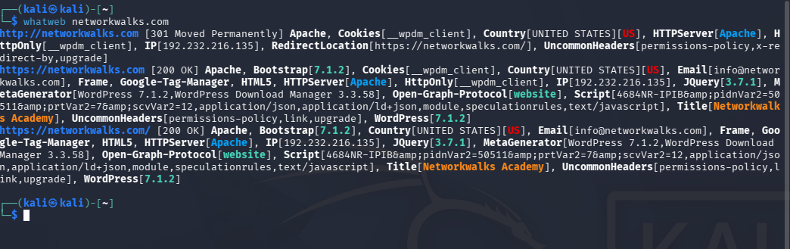
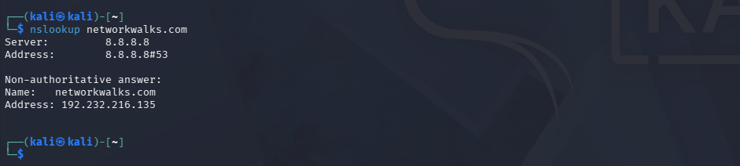
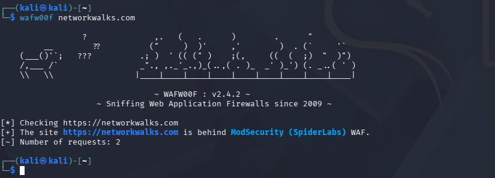
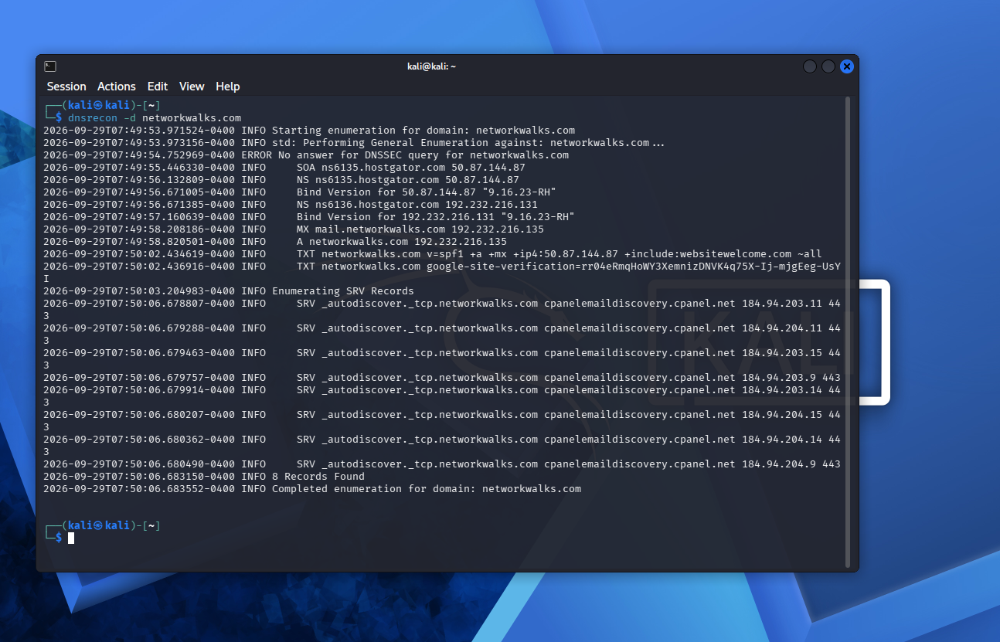
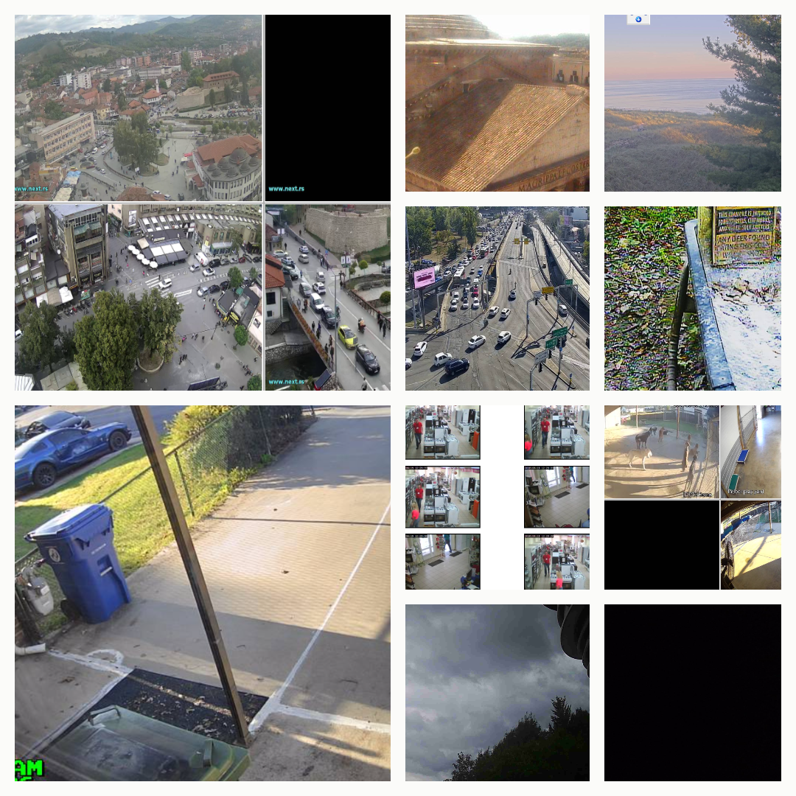
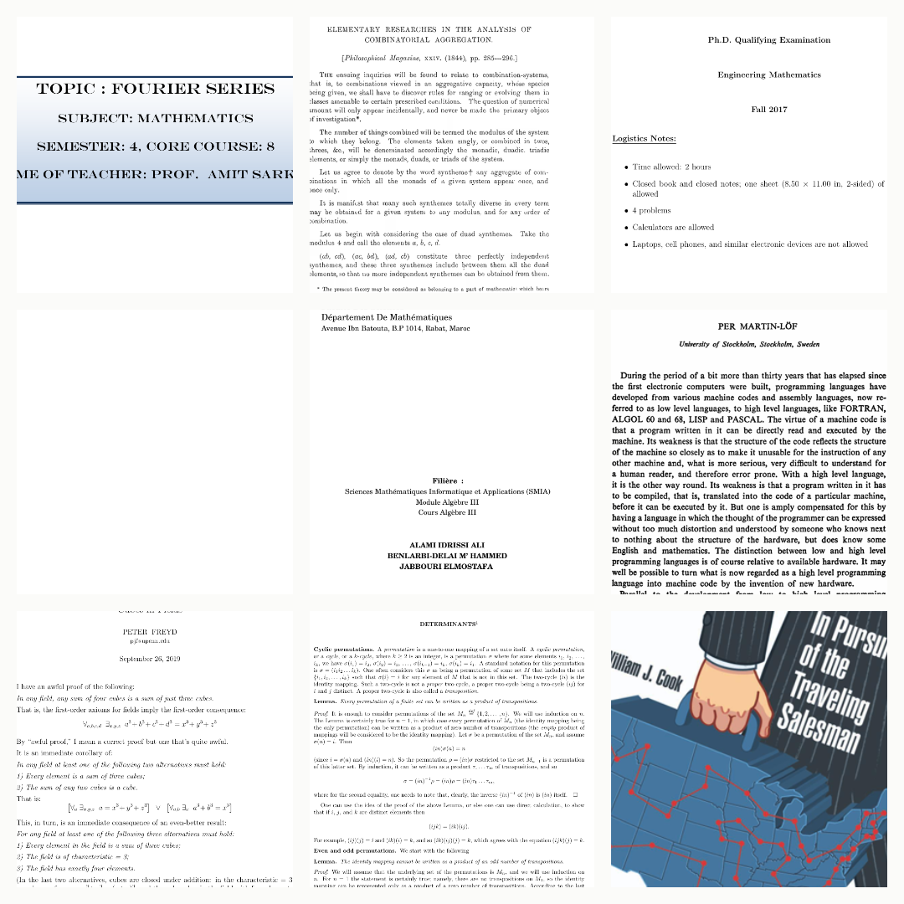
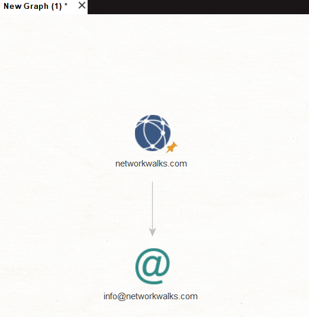
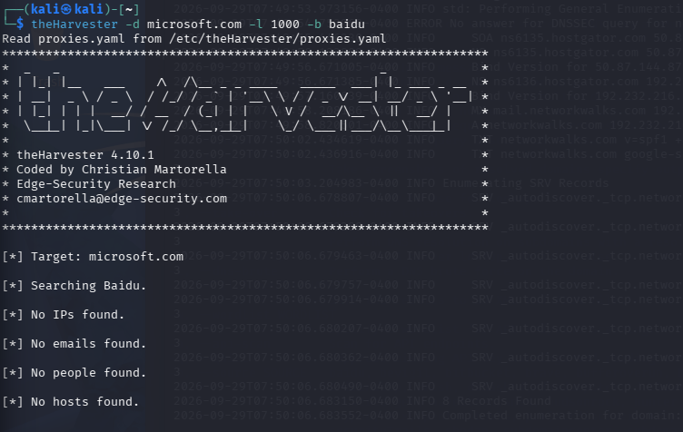
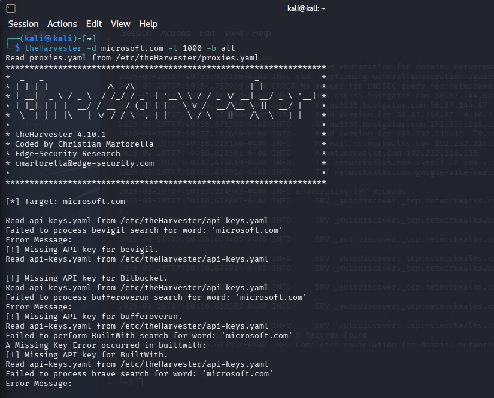
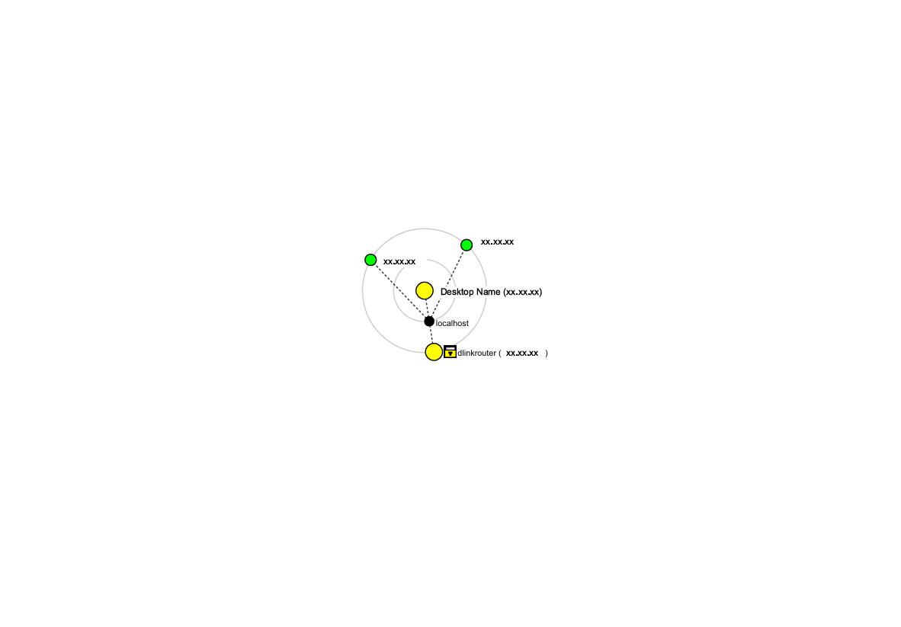

# networkwalks-B083C-week2-Reconnaissance-FootPrinting-
Reconnaissance (FootPrinting)

##  PROJECT OVERVIEW

For Week 2 of the Cyber Security Internship held by network walks I explored Reconnaissance also known as Foot printing. It is the first step into ethical hacking and the aim is to find and gather all accessible information on the target. I tried out multiple tools, being: multi-tool  foot printing on Kali Linux, Google Hacking Database(GHDB), Maltego, Harvester and Nmap.

---

## DISCLAIMER

⚠️ **Important:** This laboratory must only be used for systems that you own or have explicit permission to test. Do not use the lab or its tools to attack unauthorized systems.

---

##  OBJECTIVES

- Run whois, whatweb, nslookup, curl, wafw00f, dnsrecon on Kali Linux against networkwalks.com
- Run Harvester; a pre-installed Kali Linux
- Use Google Hacking Database to find unprotected vulnerabilities
- Install Maltego and find email addresses relevant to networkwalks.com
- Install Nmap and use the Quick scan feature

### PM1. Multi-Tool Foot Printing on Kali Linux

I performed reconnaissance against the `networkwalks.com` domain using six Kali Linux tools: **WHOIS, WhatWeb, Nslookup, Curl, Wafw00f and DNSRecon**. Each tool was used to collect a different type of information about the target.

## whois

```bash
whois networkwalks.com
```


First, I used **WHOIS** to obtain publicly available domain registration information and identify the domain’s name servers. The results provided information about the domain registration and hosting infrastructure.


## whatweb

```bash
whatweb networkwalks.com
```

I then used **WhatWeb** to identify technologies used by the website. The results identified WordPress 7.1.2 and WordPress Download Manager 3.3.58, along with other information exposed by the website.



## nslookup

```bash
nslookup networkwalks.com
```
Using **Nslookup**, I resolved the domain name to its IP address. The provided result identified 192.232.216.135.



## curl -I

```bash
curl -I https://networkwalks.com
```
I used **Curl** with the `-I` option to inspect the HTTP response headers. This provided additional information about the web application and exposed the WordPress REST API endpoint wp-json.


## wafw00f

```bash
wafw00f networkwalks.com
```

Next, I used **Wafw00f** to determine whether a Web Application Firewall was protecting the website. The result identified ModSecurity (SpiderLabs).



## DNSRecon

```bash
dnsrecon -d networkwalks.com
```
Finally, I used **DNSRecon** to enumerate DNS records. The results provided information relating to name servers, mail servers, SPF/TXT records, service records and DNS software information.



### PM2. GOOGLE HACKING DATABASE (GDHB)

Using the dorks from GDHB I searched for exposed public files; it is to be noted that I did not attempt to view password protected files or camera footage.

Here's what I found: 

## 10 exposed live cameras 

| No. | Link | Relevant Dork |
|---|---|---|
| 1 | `http://67.162.253.121:10001/` | `intitle:"webcamXP 5" inurl:admin.html` |
| 2 | `http://109.233.191.130:8080/multi.html` | `intitle:"webcamXP 5" inurl:8080 'Live'` |
| 3 | `http://195.223.180.50/` | `intitle:"webcamXP" inurl:8080` |
| 4 | `http://99.114.240.169:8080/` | `intitle:"Webcam" inurl:WebCam.htm` |
| 5 | `http://109.206.96.249:8080/` | `intitle:"webcam 7" inurl:'/gallery.html'` |
| 6 | `http://184.57.102.6:5432/` | `intitle:"webcamxp 5" intext: "live stream"` |
| 7 | `http://85.93.53.175:8080/gallery.html?page=6` | `intitle:"webcamXP 5" inurl:8080 'Live' ` |
| 8 | `http://68.115.218.130:32479/multi.html` | `inurl:/multi.html intitle:webcam` |
| 9 | `http://phildorian.hopto.org:8080/` | `intitle:"webcamxp" "Flash JPEG Stream"` |
| 10 | `http://myfishcam.homedns.org:444/ ` | `intitle:"webcamxp" "Flash JPEG Stream"` |



## 10 exposed maths pdfs

| No. | Link | Relevant Dork |
|---|---|---|
| 1 | `https://www.skylineuniversity.ac.ae/pdf/math/ ` | `intitle:index.of "parent directory" mathematics pdf` |
| 2 | `https://www.unm.edu/~megrad/Math/Mathematics-2017.pdf` | `intitle:index.of "parent directory" mathematics pdf` |
| 3 | `https://math.ucr.edu/home/baez/mathematical/sylvester_combinatorial_aggregation.pdf` | `intitle:index.of "parent directory" maths pdf` |
| 4 | `https://www.fsr.ac.ma/DOC/cours/maths/ALAMI/SMIA.S2.Algebre%203.%20CH%201,2,3,4.pdf` | `intitle:index.of "parent directory" mathematics pdf` |
| 5 | `https://sajaipuriacollege.ac.in/pdf/MATHEMATICS/ilovepdf_merged-2.pdf` | `intitle:index.of "parent directory" mathematics pdf` |
| 6 | `https://www.cs.tufts.edu/comp/150FP/archive/per-martin-lof/constructive-math.pdf` | `intitle:index.of "parent directory" mathematics pdf` |
| 7 | `https://www2.math.upenn.edu/~pjf/cubes.pdf` | `intitle:index.of "parent directory" mathematics pdf ` |
| 8 | `http://erewhon.superkuh.com/library/Math/In%20Pursuit%20of%20the%20Traveling%20Salesman_%20Mathematics%20at%20the%20Limits%20of%20Computation_%20William%20J%20Cook_%202011.pdf` | `intitle:index.of "parent directory" mathematics book pdf` |
| 9 | `https://www.sci.brooklyn.cuny.edu/~mate/misc/determinants.pdf` | `intitle:index.of "parent directory" mathematics pdf` |
| 10 | `http://erewhon.superkuh.com/library/Math/In%20Pursuit%20of%20the%20Traveling%20Salesman_%20Mathematics%20at%20the%20Limits%20of%20Computation_%20William%20J%20Cook_%202011.pdf ` | `intitle:index.of "parent directory" mathematics book pdf` |



### PM3. Maltego

Install and run the Maltego, Community Edition.
Create a domain called networkwalks.com. Harvest an email related transform. 
It will then map out emails related to networkwalks.com
Maltego is essentially used to map relationships between people, domains, infrastructure, social media data, and breached information through interactive graph analysis.



### PM4. Harvester

TheHarvester is a footprinting tool which is used for gathering information of emails, sub-domains,hosts, employee names, open ports and banners from different public sources like search engines.
Harvester is pre-Installed on Kali Linux

- baidu as the source:

```bash
theHarvester -d microsoft.com -l 1000 -b baidu
```
Here -d is the target domain, -l limits the number of results to a 1000, and -b sets the data source. theHarvester then extracts the details and shows them on screen.



- all the sources:

```bash
theHarvester -d microsoft.com -l 50 -b all
```


### PM5. NETWORK SCANNING WITH ZENMAP

I used **Zenmap** to perform network discovery on my local network. The practical required me to identify my local IP address and subnet, discover live hosts, identify their IP and MAC addresses, and generate a network topology. I first used the Windows `ipconfig` command to identify my local IP address and LAN subnet. I then entered the subnet into Zenmap and selected **Ping Scan** to identify active hosts. Through this I identified that there was only 1 device on the network and was able to locate a MAC address too.
After completing the scan, I opened the **Topology** section in Zenmap, enabled the legend and saved the network topology in PDF format as required by the practical task.



#  Tools & Resources

- **Nmap:** [https://nmap.org/](https://nmap.org/)
- **Maltego:** [https://maltego.com](https://maltego.com)
- **Kali Linux:** [https://kali.org/get-kali](https://kali.org/get-kali)
- **GDHB:** [https://www.exploit-db.com/](https://www.exploit-db.com/)

---

#  Author

**Halima**

Internee BatchB083C

LinkedIn: [https://www.linkedin.com/in/halima-j-78643a373/](https://www.linkedin.com/in/halima-j-78643a373/)
